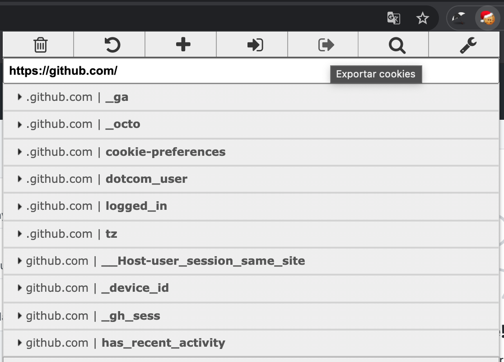

# EditThisCookie for Guzzle
[FileCookieJar] implementation for Google Chrome [EditThisCookie] extension in [Guzzle].

## Usage

This implementation allows the use of cookies exported from the Google Chrome [EditThisCookie] extension
directly in [Guzzle] and in turn.. the cookies that [Guzzle] has modified re-import them into the browser.

Example:

Once the website is logged in, export the cookies `json` in a `cookies.json` file.



```php
<?php
declare(strict_types=1);

$cookieFile = './var/cookies.json';
$client = new \GuzzleHttp\Client([
    'cookies' => new \ZoiloMora\EditThisCookie\Guzzle\FileCookieJar($cookieFile),
]);
```

## License
Licensed under the [MIT license](http://opensource.org/licenses/MIT)

Read [LICENSE](LICENSE) for more information

[FileCookieJar]: https://github.com/guzzle/guzzle/blob/7.0/src/Cookie/CookieJarInterface.php
[EditThisCookie]: http://www.editthiscookie.com/
[Guzzle]: https://docs.guzzlephp.org/en/stable/
